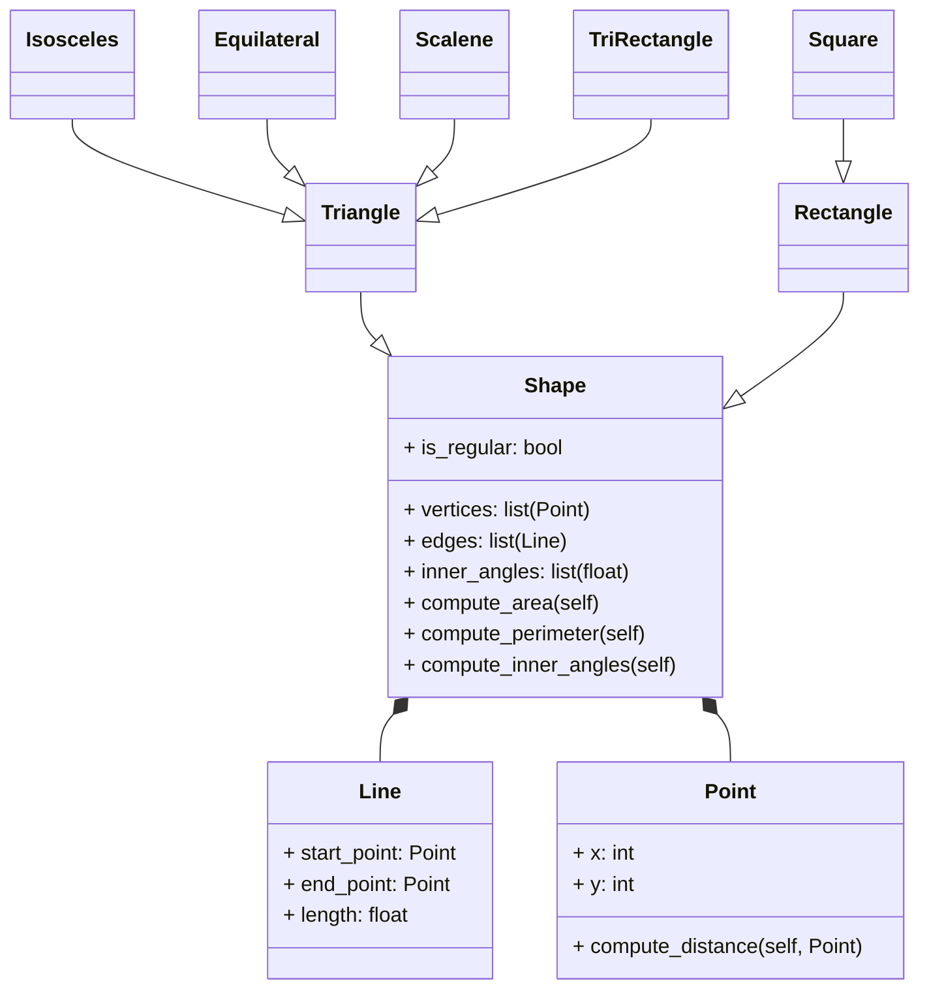

# poo_reto_4
### Soy Rafael Santiago Chirivi Peña y pertenezco al grupo de "Fenomenoides", adelante se muestra nuestro logo 

<details><summary>Preparense para ver el grandioso logo: </summary><p>
<div align='center'>
<figure> </br>
<figcaption><b> "somos programadores, no diseñadores" </b></figcaption></figure>
</div>
</p></details><br>

### A continuacion, se muestran las soluciones propuestas a los distintos puntos de este reto
1. Include the class exercise in the repo.

1. Create a superclass called Shape(), which is the base of the classes Reactangle() and Square(), define the methods compute_area and compute_perimeter in Shape() and then using polymorphism redefine the methods properly in Rectangle and in Square.

2. Using the classes Point() and Line() define a new super-class Shape() with the following structure:



Use Inheritance, Composition, Encapsulation and Polymorphism to define the classes. All attributes must have their respective setters and getters.

```python
from math import atan2
from math import degrees

class Shape:
    """Se define una clase general con metodos planos para poder ser sobreescritos en las clases heredadas"""

    def __init__(self):
        pass
    def compute_area(self):
        pass
    def compute_perimeter(self):
        pass
    def compute_inner_angles(self):
        pass

class Point:
    """Se define un punto del espacio"""

    def __init__(self,x,y):
        # se establecen coordenadas x,y para el punto
        self.x = x
        self.y = y

    def compute_distance(self, point: "Point")-> float:
        # determina la diferencia entre cada eje de coordenadas entre los puntos, y obteniendo su distancia por medio de pitagoras
        distance = ((self.x - point.x)**2+(self.y - point.y)**2)**(0.5)
        return distance


class Line:
    """Linea con un punto de inicio y uno de final"""

    def __init__(self,start: Point,end: Point):
        # se inicializa un inicio y un final aclarando que estos pertenecen a la clase Point
        self.start = start
        self.end = end

    def compute_lenght(self):
        # hace una diferencia en el eje x y el eje y para asi calcular la longitud mediante pitagoras (a^2 + b^2 = h^2)
        horizontal_lenght = self.end.x-self.start.x
        vertical_lenght = self.end.y - self.start.y
        lenght = (vertical_lenght**2 + horizontal_lenght**2)**(1/2)
        return lenght
    
    def compute_slope(self):
        # usando atan2 calcula en radianes el angulo formado por los componentes x y y del triangulo que forma la recta, para luego transformarlo a grados
        return degrees(atan2(abs(self.end.y - self.start.y), abs(self.end.x-self.start.x)))
    
    def compute_horizontal_cross(self):
        # verifica que la linea corte el eje x multiplicando su inicio y fin en y, si es negativo, pasa por el eje (Teorema de bolzano)
        if self.start.y * self.end.y <= 0:
            print("La recta corta al eje x")

    def compute_vertical_cross(self):
        # verifica que la linea corte el eje y multiplicando su inicio x fin en x, si es negativo, pasa por el eje (Teorema de bolzano)
        if self.start.x * self.end.x <= 0:
            print("La recta corta al eje y")

    def discretize_line(self, n):
        # toma un numero de puntos para discretizar la linea, y define el avance que se hara en cada eje segun la diferencia en los ejes, para luego crear una lista con cada uno de los puntos, iterando hasta que una variable i llegue al valor del n ingresado para la cantidad de puntos
        array_points = []
        x_advance = (self.end.x - self.start.x)/n
        y_advance = (self.end.y - self.start.y)/n
        i = 0
        while i <= n:
            array_points.append((self.start.x, self.start.y))
            self.start.x = self.start.x + x_advance
            self.start.y = self.start.y + y_advance     
            i += 1
        return array_points

class Rectangle(Shape):
    """Reinvencion de la clase Rectangle, añadiendo vertices, aristas y angulos internos a su definicion"""
    is_regular = False  # atributo de regularidad falso

    def __init__(self, vertices : list, edges : list, inner_angles : list):
        # se define cada una de las listas
        super().__init__()
        self._vertices = vertices
        self._edges = edges #orden: height1, width1, height2, width2
        self._inner_angles = inner_angles

    def compute_area(self):
        # toma coordenadas de los puntos de las lineas para determinar altura y anchura del rectangulo para asi calcular el area
        return ((self._edges[0].end.y-self._edges[0].start.y) * (self._edges[3].end.x - self._edges[3].start.x))
        
    def compute_perimeter(self):
        # toma coordenadas de los puntos de las lineas para determinar altura y anchura del rectangulo para asi calcular el perimetro
        return 2 * ((self._edges[0].end.y-self._edges[0].start.y) + (self._edges[3].end.x - self._edges[3].start.x))
    
    def get_vertices(self):
        # obtiene los compnentes x y y de cada punto definido para el objeto, ubicandolo en tuplas que seran puestas en una lista que es el retorno de la funcion
        vertices_get = []
        for i in range(0, len(self._vertices)):
            point_get = (self._vertices[i].x , self._vertices[i].y)
            vertices_get.append(point_get)
        return vertices_get
    
    def get_edges(self):
        # obtiene los puntos de inicio y final de cada linea, escribiendola como una cadena de la forma "(x1,y1) - (x2,y2)" para luego poner cada cadena en una lista que es el retorno de la funcion
        edges_get = []
        for i in range(0, len(self._edges)):
            line_get = f"({self._edges[i].start.x},{self._edges[i].start.y}) - ({self._edges[i].end.x},{self._edges[i].end.y})"
            edges_get.append(line_get)
        return edges_get
        
    def get_inner_angles(self):
        # retorna la lista definida de angulos internos
        return self._inner_angles
    
class Square(Rectangle, Shape):
    """Clase que hereda todos los metodos de rectangle, con una unica diferencia en su definicion, las lineas deben tener la misma longitud"""
    is_regular = True   #atributo de regularidad verdadero

    def __init__(self, vertices : list, edges : list, inner_angles : list):
        super().__init__(vertices, edges, inner_angles)

class Triangle(Shape):
    """Subclase de Shape, una figura de 3 lados"""
    is_regular = False  #atributo de regularidad falso

    def __init__(self, vertices : list, edges : list):
        # se define cada una de las listas
        super().__init__()
        self._vertices = vertices
        self._edges = edges

    def compute_perimeter(self):
        # se recorre la lista de aristas para poder calcular su longitud y asi sumarla a una variable perimetro
        perimeter = 0
        for i in range(0, len(self._edges)):
            perimeter += self._edges[i].compute_lenght()
        return perimeter
    
    def compute_area(self):
        # se utiliza la formula de heron que se apoya en el semiperimetro y las longitudes de los lados para determinar el area de cualquier triangulo
        semiperimeter = self.compute_perimeter() / 2
        return (semiperimeter * (semiperimeter - self._edges[0].compute_lenght()) * (semiperimeter - self._edges[1].compute_lenght()) * (semiperimeter - self._edges[2].compute_lenght())) ** 0.5
    
    def get_vertices(self):
        # obtiene los compnentes x y y de cada punto definido para el objeto, ubicandolo en tuplas que seran puestas en una lista que es el retorno de la funcion
        vertices_get = []
        for i in range(0, len(self._vertices)):
            point_get = (self._vertices[i].x , self._vertices[i].y)
            vertices_get.append(point_get)
        return vertices_get
    
    def get_edges(self):
        # obtiene los puntos de inicio y final de cada linea, escribiendola como una cadena de la forma "(x1,y1) - (x2,y2)" para luego poner cada cadena en una lista que es el retorno de la funcion
        edges_get = []
        for i in range(0, len(self._edges)):
            line_get = f"({self._edges[i].start.x},{self._edges[i].start.y}) - ({self._edges[i].end.x},{self._edges[i].end.y})"
            edges_get.append(line_get)
        return edges_get

class Isosceles(Triangle, Shape):
    """Clase que hereda todos los metodos de Triangle, siendo un triangulo de 2 lados iguales y 1 diferente en su definicion"""
    is_regular = False  #atributo de regularidad falso

    def __init__(self, vertices : list, edges : list):
        super().__init__(vertices, edges)

class Equilateral(Triangle, Shape):
    """Clase que hereda todos los metodos de Triangle, siendo un triangulo de 3 lados iguales en su definicion"""
    is_regular = True   #atributo de regularidad verdadero

    def __init__(self, vertices : list, edges : list):
        super().__init__(vertices, edges)

class Scalene(Triangle, Shape):
    """Clase que hereda todos los metodos de Triangle, siendo un triangulo de 3 lados diferentes en su definicion"""
    is_regular = False  #atributo de regularidad falso

    def __init__(self, vertices : list, edges : list):
        super().__init__(vertices, edges)

class TriRectangle(Triangle, Shape):
    """Clase que hereda todos los metodos de Triangle, siendo un triangulo en que uno de sus angulos internos es de 90 grados"""
    is_regular = False  #atributo de regularidad falso

    def __init__(self, vertices : list, edges : list):
        super().__init__(vertices, edges)

if __name__ == "__main__":
    # definicion para cada tipo de figura, y aplicando sus metodos con la estructura: vertices, aristas, angulos, perimetro y area
    rectangle_test = Rectangle(
        vertices = (
            Point(0,0),
            Point(3,2),
            Point(0,2),
            Point(3,0)
        ),
        edges= (
            Line(
                start = Point(0,0),
                end = Point(0,2)
            ),
            Line(
                start = Point(0,2),
                end = Point(3,2)
            ),
            Line(
                start = Point(3,2),
                end = Point(3,0)
            ),
            Line(
                start = Point(0,0),
                end = Point(3,0)
            )
        ),
        inner_angles=(90, 90, 90, 90)
    )

    print(rectangle_test.get_vertices())
    print(rectangle_test.get_edges())
    print(rectangle_test.get_inner_angles())
    print(f"El perimetro del rectangulo es de {rectangle_test.compute_perimeter()} unidades")
    print(f"El area del rectangulo es de {rectangle_test.compute_area()} unidades cuadradas \n")

    square_test = Square(
        vertices= (
            Point(0,0),
            Point(3,3),
            Point(0,3),
            Point(3,0)
        ),
        edges= (
            Line(
                start = Point(0,0),
                end = Point(0,3)
            ),
            Line(
                start = Point(0,3),
                end = Point(3,3)
            ),
            Line(
                start = Point(3,3),
                end = Point(3,0)
            ),
            Line(
                start = Point(0,0),
                end = Point(3,0)
            )
        ),
        inner_angles= [90, 90, 90, 90]
    )

    print(square_test.get_vertices())
    print(square_test.get_edges())
    print(square_test.get_inner_angles())
    print(f"El perimetro del cuadrado es de {square_test.compute_perimeter()} unidades")
    print(f"El area del cuadrado es de {square_test.compute_area()} unidades cuadradas \n")

    IsosTriangle_test = Isosceles(
        vertices = (
            Point(0,0),
            Point(4,0),
            Point(2,21 ** 0.5)
        ),
        edges = (
            Line(
                start = Point(0,0),
                end = Point(4,0),
            ),
            Line(
                start = Point(4,0),
                end = Point(2, 21 ** 0.5)
            ),
            Line(
                start = Point(2, 21 ** 0.5),
                end = Point(0,0)
            )
        )
    )

    print(IsosTriangle_test.get_vertices())
    print(IsosTriangle_test.get_edges())
    print(f"El perimetro del triangulo es de {IsosTriangle_test.compute_perimeter()} unidades")
    print(f"El area del triangulo es de {IsosTriangle_test.compute_area()} unidades cuadradas \n")

    EquiTriangle_test = Equilateral(
        vertices = (
            Point(0,0),
            Point(4,0),
            Point(2,12 ** 0.5)
        ),
        edges = (
            Line(
                start = Point(0,0),
                end = Point(4,0),
            ),
            Line(
                start = Point(4,0),
                end = Point(2, 12 ** 0.5)
            ),
            Line(
                start = Point(2, 12 ** 0.5),
                end = Point(0,0)
            )
        )
    )

    print(EquiTriangle_test.get_vertices())
    print(EquiTriangle_test.get_edges())
    print(f"El perimetro del triangulo es de {EquiTriangle_test.compute_perimeter()} unidades")
    print(f"El area del triangulo es de {EquiTriangle_test.compute_area()} unidades cuadradas \n")

    ScalTriangle_test = Scalene(
        vertices = (
            Point(0,0),
            Point(3,0),
            Point(1,16 ** 0.5)
        ),
        edges = (
            Line(
                start = Point(0,0),
                end = Point(3,0),
            ),
            Line(
                start = Point(3,0),
                end = Point(1, 16 ** 0.5)
            ),
            Line(
                start = Point(1, 16 ** 0.5),
                end = Point(0,0)
            )
        )
    )

    print(ScalTriangle_test.get_vertices())
    print(ScalTriangle_test.get_edges())
    print(f"El perimetro del triangulo es de {ScalTriangle_test.compute_perimeter()} unidades")
    print(f"El area del triangulo es de {ScalTriangle_test.compute_area()} unidades cuadradas \n")

    TriRect_test = TriRectangle(
        vertices = (
            Point(0,0),
            Point(3,0),
            Point(3,4)
        ),
        edges = (
            Line(
                start = Point(0,0),
                end = Point(3,0),
            ),
            Line(
                start = Point(3,0),
                end = Point(3,4)
            ),
            Line(
                start = Point(3,4),
                end = Point(0,0)
            )
        )
    )

    print(TriRect_test.get_vertices())
    print(TriRect_test.get_edges())
    print(f"El perimetro del triangulo es de {TriRect_test.compute_perimeter()} unidades")
    print(f"El area del triangulo es de {TriRect_test.compute_area()} unidades cuadradas \n")
```

El topico de polimorfismo no fue exactamente uno dificil de entender, sin embargo, aplicado a este caso, costo en terminos de poder mantener un orden en el cual acceder a cada una de las propiedades de las figuras para determinar sus dimensiones, sin embargo, algo que ayudo mucho a un desarrollo sin complicaciones fue el asumir que en la definicion de cada figura, estas lineas SI estarian conectada y formarian la figura asignada a la clase.

2. 2. **The restaurant revisted**
 - Add setters and getters to all subclasses for menu item
 - Override calculate_total_price() according to the order composition (e.g if the order includes a main course apply some disccount on beverages)
 - Add the class Payment() following the class example.

```python
class MenuItem:
    """Definicion estandar para un item del menu"""

    def __init__(self, name: str, price : float, origin: str, prep_time_min : int):
        # se establecen variables sencillas y generales para cada plato: nombre, precio, origen y tiempo de preparacion
        self._name = name
        self._price = price
        self._origin = origin
        self._prep_time_min = prep_time_min

    def get_item_info(self):
        # se establece un metodo que retorna una lista con las propiedades generales del objeto
        pass

class Appetizer(MenuItem):
    """Tipo 1 de item del menu: Aperitivo"""

    def __init__(self, name, price, origin, prep_time_min):
        # toma todas las variables de inicio de MenuItem
        super().__init__(name,price, origin, prep_time_min)
        self._cutlery = ["chopsticks"]    # cubierto con el cual se comen las entradas

    def get_item_info(self):
        # se establece un metodo que retorna una lista con las propiedades generales del objeto
        item_info = [
            self._name,
            self._price,
            self._origin,
            self._prep_time_min,
            self._cutlery
        ]
        return item_info

class Beverage(MenuItem):
    """Tipo 2 de item del menu: Bebida"""

    def __init__(self, name, price, origin, prep_time_min, alcohol_percent : int):
        # toma todas las variables de inicio de MenuItem, añadiendo la de porcentaje de alcohol
        super().__init__(name,price, origin, prep_time_min)
        self._alcohol_percent = alcohol_percent

    def get_item_info(self):
        # se establece un metodo que retorna una lista con las propiedades generales del objeto
        item_info = [
            self._name,
            self._price,
            self._origin,
            self._prep_time_min,
            self._alcohol_percent
        ]
        return item_info

class Main_Course(MenuItem):
    """Tipo 3 de item del menu: Plato principal"""

    def __init__(self, name, price, origin, prep_time_min, meat_amount : int):
        # toma todas las variables de inicio de MenuItem, añadiendo la de cantidad de carne
        super().__init__(name,price, origin, prep_time_min)
        self._meat_amount = meat_amount
        self._cutlery = ["chopsticks", "fork", "knife", "spoon"]  # cubierto con el cual se comen los platos principales

    def get_item_info(self):
        # se establece un metodo que retorna una lista con las propiedades generales del objeto
        item_info = [
            self._name,
            self._price,
            self._origin,
            self._prep_time_min,
            self._meat_amount,
            self._cutlery
        ]
        return item_info

class Dessert(MenuItem):
    """Tipo 4 de item del menu: Postre"""

    def __init__(self, name, price, origin, prep_time_min, sweetness : str):
        # toma todas las variables de inicio del MenuItem, añadiendo la de dulzura del postre
        super().__init__(name,price, origin, prep_time_min)
        self._sweetness = sweetness
    def get_item_info(self):
        # se establece un metodo que retorna una lista con las propiedades generales del objeto
        item_info = [
            self._name,
            self._price,
            self._origin,
            self._prep_time_min,
            self._sweetness
        ]
        return item_info

class Order:
    """orden que hara el cliente"""

    def __init__(self):
        # crea una lista vacia privada para registrar los platos a ordenar
        self.__order_list = []

    def add_item(self, plate):
        # verifica que el objeto a ingresar pertenece a la clase MenuItem, para despues agregarlo a la lista order_list
        if isinstance(plate, MenuItem):
            self.__order_list.append(plate)

    def remove_item(self, plate: MenuItem):
        # verifica que el objeto a ingresar pertenece a la clase MenuItem, para despues retirarlo de la lista order_list
        if isinstance(plate, MenuItem):
            self.__order_list.remove(plate)

    def get_list(self):
        # recorre los platos agregados a la lista y agrega sus nombres a una lista vacia para luego retornar esa lista con nombres
        list_names = []
        for i in range(0,len(self.__order_list)):
            list_names.append(self.__order_list[i]._name)
        return list_names
    
    def bill(self):
        # establece un valor de la cuenta en 0, y una lista que registre el tipo de cada plato, recorriendo la lista de la orden y sumando a la cuenta el valor del precio de cada plato, mientras registra el tipo de comida de cada plato, para al final hacer una verificacion de los tipos de platos en la orden para asi realizar un descuento de 10% (plato principal y bebida), o bien del 20% (un plato de cada tipo)
        bill = 0
        plate_type = []

        for i in range(0, len(self.__order_list)):
            plate_type.append(type(self.__order_list[i]))

        if Main_Course in plate_type and Beverage in plate_type:
            bill -= self.__order_list[plate_type.index(Beverage)]._price * 0.10 # descuento de 10% en la bebida si hay un plato principal

        if Main_Course in plate_type and Appetizer in plate_type:
            bill -= self.__order_list[plate_type.index(Main_Course)]._price * 0.10  # descuento de 10% en el plato principal si hay una entrada

        for i in range(0, len(self.__order_list)):
            bill += self.__order_list[i]._price

        if Appetizer in plate_type and Main_Course in plate_type and Beverage in plate_type and Dessert in plate_type:
            bill = bill * 0.80

        elif Beverage in plate_type and Main_Course in plate_type:
            bill = bill * 0.90
        return bill

class MedioPago:
    """superclase para metodo de pago generico"""

    def __init__(self):
        pass

    def pagar(self, monto : float):
        ...

class Efectivo(MedioPago):
    """Subclase de medio de pago en efectivo"""

    def __init__(self, monto_agregado : float):
        # inicializador para un monto de efectivo
        super().__init__()
        self.monto_agregado = monto_agregado
        
    def pagar(self, monto_a_pagar : float):
        # se realiza el descuento del dinero a pagar en el monto de dinero establecido en efectivo, arrojando un error si no hay suficientes fondos
        if self.monto_agregado >= monto_a_pagar:
            print(f"Pago de ${monto_a_pagar} realizado en efectivo. Cambio: ${self.monto_agregado - monto_a_pagar}")
        else:
            print(f"Fondos insuficientes. Faltan ${self.monto_agregado - monto_a_pagar} para completar el pago")
    
class Tarjeta(MedioPago):
    """Subclase de medio de pago en tarjeta"""

    def __init__(self, numero : str, cvv : int):
        # inicializador para ingreso de numero de tarjeta y cvv
        super().__init__()
        self.numero = numero
        self._cvv = cvv
    def pagar(self, monto_a_pagar : float, cvv : int):
        # se realiza el descuento del dinero a pagar si se ingresa correctamente el cvv de la tarjeta al llamar la funcion
        if cvv == self._cvv:
            print(f"Pagando ${monto_a_pagar} con tarjeta {self.numero[-4:]}")
        else:
            print("La clave ingresada es incorrecta, no se ha procesado el pago")

if __name__ == "__main__":
    # Definicion de 3 objetos por cada tipo de comida
    # precios establecidos en USD
    # cantidad de carne en gramos
    appet1 = Appetizer(
        name = "Takoyaki",
        price = 8.5, #USD
        origin = "japan",
        prep_time_min = 15
    )
    appet2 = Appetizer(
        name = "Tteokbokki",
        price = 7,   #USD
        origin = "Korea",
        prep_time_min = 40
    )
    appet3 = Appetizer(
        name = "Mandu",
        price = 8.5, #USD
        origin = "Korea",
        prep_time_min = 50
    )
    bev1 = Beverage(
        name = "Sake bottle",
        price = 15,  #USD
        origin = "Japan",
        prep_time_min = 0,
        alcohol_percent = 15 
    )
    bev2 = Beverage(
        name = "jiuniang",
        price = 12,  #USD
        origin = "China",
        prep_time_min = 30,
        alcohol_percent = 2
    )
    bev3 = Beverage(
        name = "bubble tea",
        price = 15,  #USD
        origin = "Taiwan",
        prep_time_min = 130,
        alcohol_percent = 0
    )
    main1 = Main_Course(
        name = "wagyu",
        price = 25,  #USD
        origin = "Japan",
        prep_time_min = 10,
        meat_amount = 300   #grams
    )
    main2 = Main_Course(
        name = "Curry",
        price = 20,  #USD
        origin = "India",
        prep_time_min = 20,
        meat_amount = 150   #grams
    )
    main3 = Main_Course(
        name = "Ramen",
        price = 20,  #USD
        origin = "Japan",
        prep_time_min = 120,
        meat_amount = 50    #grams
    )
    des1 = Dessert(
        name = "wagashi",
        price = 5,  #USD
        origin = "Japan",
        prep_time_min = 300,
        sweetness = "Moderate"
    )
    des2 = Dessert(
        name = "Yuèbǐng",
        price = 8,  #USD
        origin = "China",
        prep_time_min = 60,
        sweetness = "Low"
    )
    des3 = Dessert(
        name = "Tanghulu",
        price = 6,  #USD
        origin = "China",
        prep_time_min = 30,
        sweetness = "High"
    )

    # impresion de la informacion de todos los platos
    print("Obteniendo informacion de platos... \n")
    print(appet1.get_item_info())
    print(appet2.get_item_info())
    print(appet3.get_item_info())
    print(main1.get_item_info())
    print(main2.get_item_info())
    print(main3.get_item_info())
    print(bev1.get_item_info())
    print(bev2.get_item_info())
    print(bev3.get_item_info())
    print(des1.get_item_info())
    print(des2.get_item_info())
    print(des3.get_item_info())
    print("\n")

    # definicion de orden 1
    Client1 = Order()
    Client1.add_item(appet2)    # agregado de tteokbokki
    Client1.add_item(main2)     # agregado de curry
    Client1.add_item(bev1)      # agregado de sake
    Client1.add_item(des1)      # agregado de wagashi
    client1_bill = Client1.bill()
    print(f"La orden de {Client1.get_list()} tiene un valor de ${client1_bill} USD")   # se imprime los platos pedidos y el precio de estos

    # definicion de orden 2
    Client2 = Order()
    Client2.add_item(appet3)    # agregado de mandu
    Client2.add_item(main3)     # agregado de ramen
    Client2.add_item(bev3)      # agregado de te
    Client2.add_item(des3)      # agregado de tanghulu
    client2_bill = Client2.bill()
    print(f"La orden de {Client2.get_list()} tiene un valor de ${client2_bill} USD")   # se imprime los platos pedidos y el precio de estos

    # definicion de orden 3
    Client3 = Order()
    Client3.add_item(main1)     # agregado de wagyu
    Client3.add_item(bev1)      # agregado de sake
    client3_bill = Client3.bill()
    print(f"La orden de {Client3.get_list()} tiene un valor de ${client3_bill} USD")   # se imprime los platos pedidos y el precio de estos

    # pago de la orden del cliente 1 (en efectivo), y cliente 2 (con tarjeta)
    Client1_payment = Efectivo(50.0)
    Client2_payment = Tarjeta("1441589435", 101)

    print("\n")
    Client1_payment.pagar(client1_bill)
    Client2_payment.pagar(client2_bill, 101)
```

El desarrollo de este ejercicio fue muy util en la medida de que se sintio la recursividad de los ejercicios anteriores y como siempre se puede hacer algo mejor para completar un ejercicio que parecia terminado, y aunque costo aplicar la parte de los descuentos, solo hizo falta tomar en cuenta el orden de algunas operaciones y condicionales para completarlo de manera definitiva.
